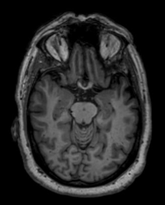

# quantifying_hippocampus_volume_3D_images_segmentation

## Project Motivations

Alzheimer's disease (AD) is a progressive neurodegenerative disorder that results in impaired neuronal (brain cell) function and eventually, cell death. AD is the most common cause of dementia. Clinically, it is characterized by memory loss, inability to learn new material, loss of language function, and other manifestations.

For patients exhibiting early symptoms, quantifying disease progression over time can help direct therapy and disease management.

A radiological study via MRI exam is currently one of the most advanced methods to quantify the disease. In particular, the measurement of hippocampal volume has proven useful to diagnose and track progression in several brain disorders, most notably in AD. Studies have shown a reduced volume of the hippocampus in patients with AD.

The hippocampus is a critical structure of the human brain (and the brain of other vertebrates) that plays important roles in the consolidation of information from short-term memory to long-term memory. In other words, the hippocampus is thought to be responsible for memory and learning

There is one problem with measuring the volume of the hippocampus using MRI scans, though - namely, the process tends to be quite tedious since every slice of the 3D volume needs to be analyzed, and the shape of the structure needs to be traced. The fact that the hippocampus has a non-uniform shape only makes it more challenging. Do you think you could spot the hippocampi in this axial slice below?

As you might have guessed by now, we are going to build a piece of AI software that could help clinicians perform this task faster and more consistently.

## Dataset

We are using the "Hippocampus" dataset from the [Medical Decathlon competition](http://medicaldecathlon.com/). This dataset is stored as a collection of NIFTI files, with one file per volume, and one file per corresponding segmentation mask. The original images here are T2 MRI scans of the full brain. As noted, in this dataset we are using cropped volumes where only the region around the hippocampus has been cut out.
Our (fictional) radiology department runs a HippoCrop tool which cuts out a rectangular portion of a brain scan from every image series, making the job a bit easier, and our committed radiologists have collected and annotated a dataset of relevant volumes, and even converted them to NIFTI format!

## The Programming Environment

### Local Envronment

f you would like to run the project locally, you would need a Python 3.7+ environment with the following libraries for the first two sections of the project:

- PyTorch (preferably with CUDA)
- nibabel
- matplotlib
- numpy
- pydicom
- Pillow (should be installed with pytorch)
- tensorboard

In the 3rd section of the project we will be working with three software products for emulating the clinical network. You would need to install and configure:

- `Orthanc server`: for PACS emulation
- `OHIF zero-footprint web viewer`: for viewing images.
- `DCMTK tools`: for testing and emulating a modality

## Algorithm Performance Metrics

We evaluated the algorithm's performance using metrics such as Dice coefficient and Jaccard (IoU) similarity coefficient. Sensitivity and specificity metrics were also utilized to evaluate the model. All metrics indicated that the algorithm achieved a success rate of over 80% in segmentation. Notably, sensitivity and specificity exceeded 95%, demonstrating the algorithm's proficiency in accurately segmenting the volume of the hippocampus and distinguishing it from other brain regions considered as background.

